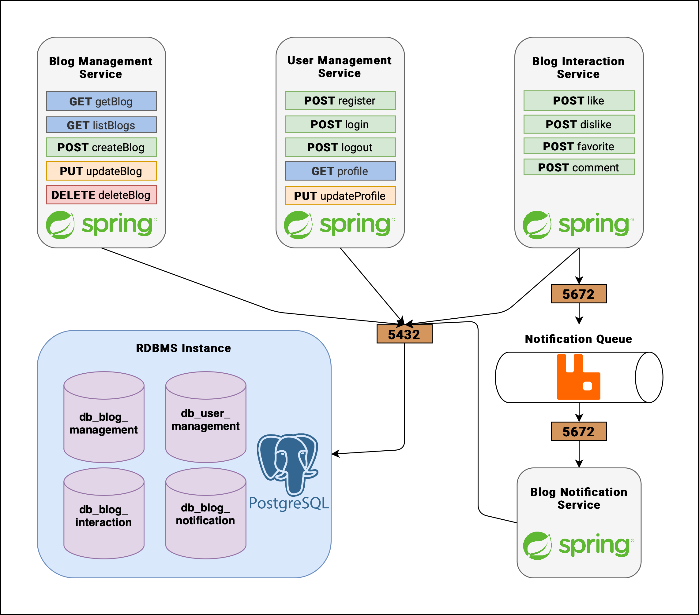

# Blogs-Microservices

## Overview

### General

This repo is a blog platform proof of concept using technologies such as Spring Boot, PostgreSQL, and RabbitMQ. The platform's back-end is split into several microservices, each dedicated to a single domain of the platform.

A diagram of the architecture can be seen below:

